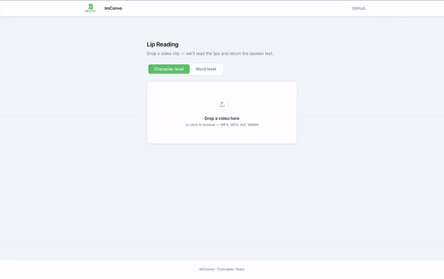

# ImConvo: Deployment, DevOps & MLOps Knowledge Base

This document contains a distilled technical breakdown of the integration issues, MLOps decisions, and DevOps troubleshooting steps encountered during the migration of **ImConvo** from an experimental graduate repository to a production-grade serverless application.

---

## 🏗️ System Architecture

ImConvo is decoupled into a modern web client and a serverless machine learning inference backend:

### 1. Local Architecture
* **Frontend**: Next.js (TailwindCSS v4, React 19) running on `http://localhost:3000`.
* **Backend**: FastAPI running on `http://localhost:8001`, reading model weights from the local `checkpoints/` directory.

### 2. Production Serverless Architecture (Decoupled Weights)
To avoid container image bloat (which slows down deployment times and increases cold start latency), we decoupled the model weights (~190MB) from the Docker container (~300MB):
```
  ┌─────────────────────────────────────────────────────────┐
  │                   GOOGLE CLOUD PLATFORM                 │
  │                                                         │
  │  ┌─────────────────────────┐                            │
  │  │  Cloud Storage Bucket   │                            │
  │  │ (imconvo-model-weights) │                            │
  │  └────────────┬────────────┘                            │
  │               │ Natively Mounts via FUSE                │
  │               ▼                                         │
  │  ┌───────────────────────────────────────────────────┐  │
  │  │ Google Cloud Run (FastAPI Backend Container)      │  │
  │  │ Mounted Path: /code/checkpoints                   │  │
  │  └───────────────────────────────────────────────────┘  │
  └───────────────────────────▲─────────────────────────────┘
                              │ REST APIs & WebSockets
                              │
                    ┌─────────┴─────────┐
                    │  Vercel Frontend  │
                    │ (Next.js Web UI)  │
                    └───────────────────┘
```
* **Storage**: Weights live in a Google Cloud Storage (GCS) bucket in the Sydney region (`australia-southeast1`).
* **Mounting**: Google Cloud Run uses native **Cloud Storage FUSE** to mount the GCS bucket directly into the container's `/code/checkpoints` directory at boot.
* **On-Demand Loading**: TensorFlow loads the weights on-demand directly from the virtual mount path, keeping the container image lean and fast.

---

## ⚠️ Local Integration Errors & Resolutions

### 1. The Git LFS "Disappearing Weights" Trap
#### 🔍 The Problem
We pruned unused checkpoints to clean up the repository. However, swapping branches (e.g., from `restore-showcase` to `main`) checked out Git LFS files as **133-byte pointer files** instead of binary files. Swapping branches also deleted untracked checkpoints because they didn't exist in the target branch index.

#### 💡 The Resolution
To restore the binary weights without triggering SSH passphrase inputs or losing untracked files:
1. Switched temporarily to the branch holding the downloaded weights.
2. Copied the files to a safe directory outside the repo:
   ```bash
   cp -r checkpoints/word_level_grid /tmp/word_level_grid_tmp
   ```
3. Switched back to the working branch (`main`) using a force checkout:
   ```bash
   git checkout -f main
   ```
4. Recreated the folders and copied the weights back:
   ```bash
   mkdir -p checkpoints/word_level_grid
   cp -r /tmp/word_level_grid_tmp/* checkpoints/word_level_grid/
   ```
5. Kept them untracked and git-ignored on the working branch.

### 2. Next.js SSR Hydration Mismatch (`localStorage`)
#### 🔍 The Problem
React threw a Hydration Mismatch Error: `Hydration failed because the server rendered text didn't match the client.` This was caused by the React State initializer reading values from the browser's `localStorage` on page load:
```typescript
// BREAKS HYDRATION:
const [state, dispatch] = useReducer(gameReducer, {
  score: typeof window !== 'undefined' ? Number(localStorage.getItem("score")) : 0
});
```
* The server rendered an initial score of `0` (since `localStorage` is undefined on the server).
* The client browser rendered `2` (the stored score). The HTML mismatched, causing a hydration error.

#### 💡 The Resolution
Initialize client state with static values (`0`) on both server and client. Load client-only values inside a client-side `useEffect` mount hook and dispatch an action to populate the state:
```typescript
const initialState = { score: 0, bestStreak: 0 };

useEffect(() => {
  const score = Number(localStorage.getItem("score")) || 0;
  const bestStreak = Number(localStorage.getItem("bestStreak")) || 0;
  dispatch({ type: "LOAD_SAVED_STATE", score, bestStreak });
}, [dispatch]);
```

### 3. OpenCV WebM Transcoding Fallback
#### 🔍 The Problem
Browser webcams record video as `.webm` streams. WebM is not natively readable by OpenCV's standard Linux builds (`cv2.VideoCapture`), causing frame extraction to return `frame_count = None` and throw a `400 Bad Request`.

#### 💡 The Resolution
We added an `ffmpeg` transcoding wrapper inside the video preprocessing routine [api/main.py](file:///home/nam/ImConvo/api/main.py):
1. Detect if the file format suffix is `.webm`.
2. Spawn a subprocess to convert the WebM video to a standard, audio-less (`-an`) H.264 standard MP4 container:
   ```python
   subprocess.run([
       "ffmpeg", "-hide_banner", "-loglevel", "error", "-y", "-i", video_path,
       "-c:v", "libx264", "-preset", "veryfast", "-crf", "22",
       "-pix_fmt", "yuv420p", "-movflags", "+faststart", "-an", temp_mp4
   ])
   ```
3. Read the transcoded MP4 stream using OpenCV, and clean up temporary files in a `finally` block.

### 4. Pruned/Missing Model Graceful Fallback
#### 🔍 The Problem
We pruned 9 out of 10 CTC models. However, users with older cached browser local storage requested models that had been deleted (e.g. `best_ctc_model_transformer.keras`), crashing the API with `Model not found`.

#### 💡 The Resolution
We implemented a **graceful fallback** mechanism inside [api/_models.py](file:///home/nam/ImConvo/api/_models.py):
* If the requested model path does not exist on disk, look for the main default production weights file (`checkpoints/best_ctc_model_conformer_lite_gap_proj.keras`) and load it instead:
  ```python
  if not os.path.exists(model_path):
      fallback = str(DEFAULT_CTC_PATH.resolve())
      if os.path.exists(fallback):
          print(f"[API] Warning: Model '{model_path}' not found on disk. Falling back to default.")
          model_path = fallback
  ```

---

## ☁️ Google Cloud Platform (GCP) Deployment Errors

### 5. Hidden CLI Prompts & API Activation Hangs
#### 🔍 The Problem
Our script `./deploy_backend.sh` hung indefinitely at:
`📦 3/5 Checking Artifact Registry repository...`
Behind the scenes, the Artifact Registry API was not yet enabled in the GCP project. `gcloud` prompted: `API [artifactregistry.googleapis.com] not enabled on project. Would you like to enable it? (y/N)?`. Because standard output/error were redirected to `/dev/null` inside the script to keep logs clean, the prompt was invisible and the script sat waiting for user input.

#### 💡 The Resolution
1. **Explicit API Activation**: Added an explicit API activation step at the start of the script.
2. **Quiet Flag**: Appended the `--quiet` flag to all `gcloud` commands, forcing non-interactive mode.
   ```bash
   gcloud services enable \
     artifactregistry.googleapis.com \
     cloudbuild.googleapis.com \
     run.googleapis.com --quiet
   ```

### 6. Cloud Build Source Upload Permission (403)
#### 🔍 The Problem
When running `gcloud builds submit`, the operation failed with:
`Error 403: [PROJECT_NUMBER]-compute@developer.gserviceaccount.com does not have storage.objects.get access to the Google Cloud Storage object.`
By default, Cloud Build uses the default Compute Engine service account. In new projects, this account lacks permissions to read the source tarball from the default Cloud Build storage bucket.

#### 💡 The Resolution
We granted the **Storage Object Viewer** (`roles/storage.objectViewer`) role to the compute service account at the project level:
```bash
gcloud projects add-iam-policy-binding [PROJECT_ID] \
  --member="serviceAccount:[PROJECT_NUMBER]-compute@developer.gserviceaccount.com" \
  --role="roles/storage.objectViewer"
```

### 7. Optimizing Build Uploads with `.gcloudignore`
#### 🔍 The Problem
Cloud Build archived and uploaded **1.0 GiB (18,000+ files)** on every run because it was packaging `node_modules/`, local `.venv/`, local `checkpoints/`, and massive local datasets. This led to slow uploads, high bandwidth usage, and timeouts.

#### 💡 The Resolution
Created a [.gcloudignore](file:///home/nam/ImConvo/.gcloudignore) file at the root:
```text
.git
.venv/
node_modules/
frontend/
data/
checkpoints/
```
By ignoring the frontend, model weights (handled via GCS FUSE), and dependencies, the upload size dropped from **1.0 GiB to under 1 MB** (instant uploads!).

### 8. Debian Package Obsolescence (`libgl1-mesa-glx`)
#### 🔍 The Problem
The build failed when compiling the Docker image:
`E: Package 'libgl1-mesa-glx' has no installation candidate`
Debian 12 (Bookworm) and newer releases (the base for `python:3.12-slim`) have deprecated and removed the older `libgl1-mesa-glx` library package.

#### 💡 The Resolution
We updated the [Dockerfile](file:///home/nam/ImConvo/Dockerfile) to install **`libgl1`**, which is the modern standard package for OpenGL bindings:
```dockerfile
RUN apt-get update && apt-get install -y --no-install-recommends \
    build-essential \
    libgl1 \
    libglib2.0-0
```

### 9. Artifact Registry Push Permission (403)
#### 🔍 The Problem
Cloud Build failed to push the compiled Docker image, returning:
`denied: Permission 'artifactregistry.repositories.uploadArtifacts' denied on resource`
The default Compute Engine service account running the build lacked write permissions to the newly created Artifact Registry repository.

#### 💡 The Resolution
We granted the **Artifact Registry Writer** (`roles/artifactregistry.writer`) role to the service account:
```bash
gcloud projects add-iam-policy-binding [PROJECT_ID] \
  --member="serviceAccount:[PROJECT_NUMBER]-compute@developer.gserviceaccount.com" \
  --role="roles/artifactregistry.writer"
```

### 10. Container Port Binding & Health Check Failures
#### 🔍 The Problem
Cloud Run deployments timed out and failed:
`The user-provided container failed to start and listen on the port defined provided by the PORT=8080 environment variable...`
* **First Attempt**: We hardcoded Uvicorn to listen on `8001` in the Dockerfile `CMD`. Cloud Run's health checker polled `8080` (which is mapped to the outside world), received no response, and killed the container.
* **Second Attempt**: We used `CMD ["sh", "-c", "uvicorn ... --port \${PORT:-8001}"]`. The literal backslash and quote combination caused Docker to double-wrap the command, leading to `/bin/sh: [sh,: not found` and instant crashes.

#### 💡 The Resolution
We changed the `CMD` to use the standard **shell form**, letting Docker invoke the shell natively to resolve the `PORT` env var:
```dockerfile
CMD uvicorn api.main:app --host 0.0.0.0 --port ${PORT:-8001}
```

### 11. MediaPipe Headless Shared Library Dependencies (`libgles2`, `libegl1`)
#### 🔍 The Problem
Once the container launched successfully on port `8080`, it crashed during face landmark extraction with:
`OSError: libGLESv2.so.2: cannot open shared object file` and later `OSError: libEGL.so.1: cannot open shared object file`.
MediaPipe's Python wrapper uses low-level C++ bindings that expect OpenGL ES (`GLESv2`) and rendering context (`EGL`) system libraries to be present, which are omitted in minimal slim Python Docker images.

#### 💡 The Resolution
We updated the [Dockerfile](file:///home/nam/ImConvo/Dockerfile) system dependencies list to install **`libgles2`** and **`libegl1`**:
```dockerfile
RUN apt-get update && apt-get install -y --no-install-recommends \
    build-essential \
    libgl1 \
    libglib2.0-0 \
    libgles2 \
    libegl1 \
    ffmpeg
```

---

## 🌐 Frontend Vercel & CORS Errors

### 12. Vercel Root Directory & 404 Route Mismatch
#### 🔍 The Problem
Visiting the deployed Vercel domain returned a Vercel-branded `404: NOT_FOUND (syd1::...)` on the homepage. Vercel was building the root folder `.` (which has no web pages) instead of the `frontend/` directory.

#### 💡 The Resolution
We navigated to **Project Settings -> General** in Vercel, configured the **Root Directory** to `frontend`, and triggered a **Redeploy**.

### 13. Cross-Origin Resource Sharing (CORS) Blocked
#### 🔍 The Problem
The frontend console output was blocked by the browser CORS policy:
`Access to XMLHttpRequest at 'https://[RUN_URL]/analyze' from origin 'https://[VERCEL_URL]' has been blocked by CORS policy: No 'Access-Control-Allow-Origin' header is present...`
The FastAPI backend was configured to only allow origins matching `localhost:3000`, rejecting the dynamic production Vercel origins.

#### 💡 The Resolution
We updated the `CORSMiddleware` in `api/main.py`. Since our API is stateless (does not use cookies or session credentials), we set `allow_credentials=False` and allowed all origins `["*"]` by default in production (with support for custom origin lists via the `IMCONVO_ALLOWED_ORIGINS` environment variable):
```python
ALLOWED_ORIGINS = [
    origin.strip() for origin in os.getenv("IMCONVO_ALLOWED_ORIGINS", "*").split(",")
]

app.add_middleware(
    CORSMiddleware,
    allow_origins=ALLOWED_ORIGINS,
    allow_credentials=False,
    allow_methods=["*"],
    allow_headers=["*"],
)
```

---

## 🛠️ Git & Workflow Optimizations

### 14. Silencing Multiple SSH Passphrase Prompts
#### 🔍 The Problem
Every time we ran `git push`, the terminal prompted for the SSH private key passphrase exactly **5 times**. Even after deleting `.gitattributes`, Git LFS local hooks (`.git/hooks/pre-push`) were still triggering multiple background SSH handshakes with GitHub's LFS authentication servers.

#### 💡 The Resolution
1. **Remove Hooks**: Run `git lfs uninstall --local` to strip the LFS hook scripts out of the local `.git/` folder. Subsequent pushes will only prompt exactly **once** (standard SSH check).
2. **SSH Agent Caching**: Add the key to `ssh-agent` in the terminal session to cache the decrypted key in RAM, reducing the prompt count to **zero**:
   ```bash
   eval "$(ssh-agent -s)"
   ssh-add ~/.ssh/id_ed25519
   ```

### 15. GitHub README Video vs. GIF
#### 🔍 The Problem
Using the relative path `` in the README displayed a broken image box on GitHub because Markdown `` syntax is strictly for static images/gifs.

#### 💡 The Resolution
We used `ffmpeg` to transcode the video into a highly optimized, custom 256-color palette `.gif` file under 2.5MB:
```bash
ffmpeg -y -i demo.mp4 -vf "fps=10,scale=640:-1:flags=lanczos,split[s0][s1];[s0]palettegen[p];[s1][p]paletteuse" demo.gif
```
We deleted `demo.mp4` from the repository index, added `demo.gif`, and changed the README display back to standard Markdown:
```markdown

```
This guarantees an autoplaying, looping demo that loads instantly for anyone visiting the project on GitHub.
